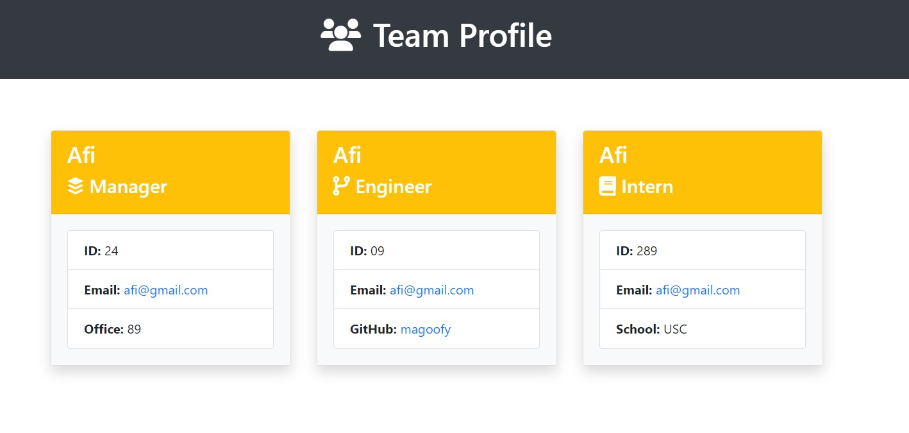

# Team Profile Generator

This application was made for my Berkely Coding Bootcamp. Its purpose is to dynamically generate profile cards for a team using user inputs.



## Video Tutorial

This is a link to a video tutorial of the application
https://drive.google.com/file/d/1hSohF2-8MAqQ6KdxKRd2AU972278gqFy/view

## Installation

You first must install all the required packages

```bash
npm install
```

## Technology Used

Node, Jest, Babel

## Contributing

Afi Akau
